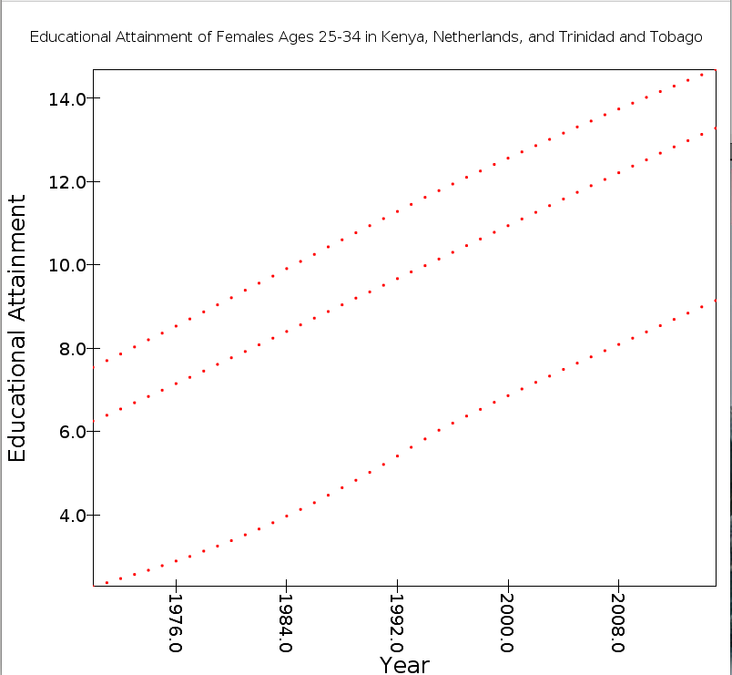

# Trip Phillips

#9-7-19

##Basic Scala Problem Set

**Problem #1**
Under the values that are reported in the education file under the metric column there are 3 types.  These types are Age Standardized Education Per Capita, Education Per Capita, and Population Weighted Education Per Capita.

**Problem #2**
The five entries with the highest mean value for Education Per Capita are:
1. Country - Andorra, Year - 2015, Mean - 16.06
1. Country - Andorra, Year - 2014, Mean - 15.96
1. Country - Andorra, Year - 2013, Mean - 15.85
1. Country - Andorra, Year - 2012, Mean - 15.74
1. Country - Israel, Year - 2015, Mean - 15.68

**Problem #3**
The country with the largest increase in mean education per capita is the United Arab Emirates with a value of 9.07.

**Question #4**
The country with the largest mean GDP per capita in 1970 was Andorra with a GDP of 42137.5189947395.
The country with the smallest mean GDP per capita in 1970 was Myanmar with a GDP of 169.688262077814.

**Question #5**
The country with the largest mean GDP per capita in 2015 was Luxembourg with a GDP of 41765.9203531235
The country with the smallest mean GDP per capita in 2015 was Burundi with a GDP of 1342.26306433207

**Question #6**
The country with the largest increase in mean GDP per capita from 1970 to 2015 was Luxembourg with 72191.37228147639

**Question #7**
The scatter plot of educational attainment of females ages 25 to 34 from 1970 to 2015 in Kenya, the Netherlands, and Trinidad and Tobago.

**Question #8**
**Question #9**
**Question #10**